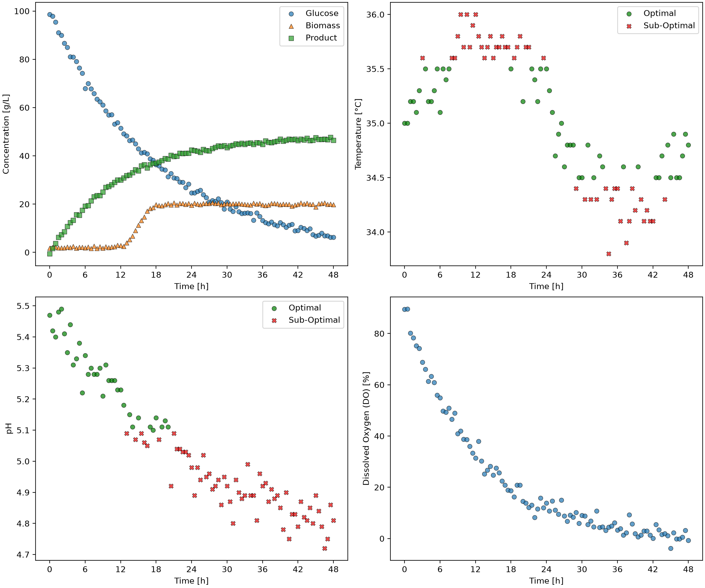

1. Project name:
Bio Control - A system that automates the tracking of the operating conditions and the product concentration of bioprocesses.
2. Overview:
The goal of this project was to create an automated system that tracks bioreactor data, compares it against environmental thresholds, and exports reports of individual batches.
3. Features:
This class extracts batch data from a csv file and compares it against the established limits for pH and temperature.
Then, it determines if the conditions are within the optimal range or not.
It generates graphs and tables to display the batch conditions over time and whether they are within the optimal range or not.
4. Technologies used:
Python: 3.14.7
Pandas: 3.0.5
Matplotlib: 3.11.0
5. Code design:
The code imports the data given by the user in the form of a csv file and converts it to a pandas dataframe.
Then, it checks the environmental conditions (pH and temperature) against the defined limits (based on mode A or B) and establishes when the conditions are within the optimal range.
From this, it generates a dashboard with multiple graphs for each batch:
   1. Concentration of substances in the bioreactor over time
   2. Temperature over time and whether it is in optimal range or not
   3. pH over time and whether it is in optimal range or not
   4. Dissolved oxygen over time
It also generates 2 summary tables of all the batches (1 for mode A and 1 for mode B).
6. Dashboard:

The graph in the top left displays concentration over time. Glucose concentration decreases while biomass and product concentration increase.
Interestingly, there is a big step in the biomass concentration between 12 and 18 hours that is not seen for glucose and product.
The graph in the top right shows temperature over time. We notice a sine wave pattern in the temperature changes.
As shown, the maximum and minimum of the sine wave are outside of the optimal range for this process.
The graph in the bottom left show pH over time. Unlike temperature, pH declines steadily throughout the entire process.
It is in optimal range for roughly the first 18 hours and then it drops below the lower limit.
The graph in the bottom right shows dissolved oxygen over time.
We can see it drop from roughly 90% to 20% in 12 hours. It takes another 36 hours for the dissolved oxygen to drop to about 0%.
This indicates a very fast drop at the start of the process and a much slower one towards the end.
7. Summary table:
[Summary Table Preview](tables/Summary_Mode_A.md)
This table shows a summary of the information for all 5 batches.
It indicates what percentage of measurements were within optimal range for pH and also does the same for temperature.
For mode A, all 5 batches were within optimal conditions for most of the process except for batch 5, which was in optimal pH range for less than 50% of the batch.
It also displays the final product concentration at the end of the batch.
The final product concentration is around 40 to 50 g/L for all batches except batch 5, which had a final concentration of 24.7 g/L.
This table shows at a glance that batch 5 was far less successful than the 4 other batches.
